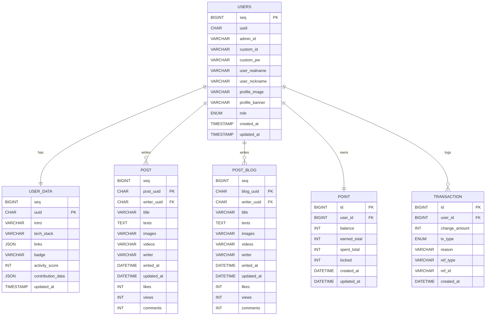

## ADA 프로젝트 DB 구조 정리

이 페이지는 ADA 프로젝트에서 사용되는 주요 데이터베이스 테이블 구조를 정리한 문서입니다.  
각 테이블의 필드, 타입, 설명을 직관적으로 확인할 수 있습니다.

---

## 1. ERD (Entity Relationship Diagram)

> ERD 이미지는 `/static/img/erd.png` 에 업로드하세요.

---

## 2. user 테이블 (유저 기본정보)

사용자의 기본 계정 정보를 저장합니다.  
로그인 정보, 권한, 프로필 요소 등이 포함됩니다.

| 필드명         | 타입                                       | 설명                                   |
| -------------- | ------------------------------------------ | -------------------------------------- |
| seq            | BIGINT (AI) [AUTO_INCREMENT]               | 내부 DB용 사용자 번호                  |
| uuid           | CHAR(36) (PK), UNIQUE                      | 외부 노출/보안용 UUID                  |
| admin_id       | VARCHAR(50), UNIQUE                        | 최초 관리자 발급 ID (변경 불가)        |
| custom_id      | VARCHAR(50), UNIQUE, NULL                  | 사용자가 새로 만든 로그인 ID           |
| custom_pw      | VARCHAR(255), NULL                         | 사용자 커스텀 PW (없으면 기본 PW 사용) |
| user_realname  | VARCHAR(10)                                | 실명 (변경 불가)                       |
| user_nickname  | VARCHAR(10)                                | 닉네임 (공백 포함 10글자)              |
| profile_image  | VARCHAR(255)                               | 프로필 이미지 URL                      |
| profile_banner | VARCHAR(255)                               | 프로필 배너 이미지 URL                 |
| role           | ENUM('ADMIN','TEACHER','STUDENT','MENTOR') | 사용자 권한                            |
| created_at     | TIMESTAMP                                  | 생성일                                 |
| updated_at     | TIMESTAMP                                  | 수정일                                 |

---

## 3. user_data 테이블 (마이페이지 관련)

> 마이페이지 데이터이며 **수정될 가능성이 높은 영역**

| 필드명            | 타입                           | 설명                             |
| ----------------- | ------------------------------ | -------------------------------- |
| seq               | BIGINT (AI)                    | 내부 순번                        |
| uuid              | CHAR(36) (PK, FK → users.uuid) | 유저 식별자                      |
| intro             | VARCHAR(255)                   | 자기소개                         |
| tech_stack        | VARCHAR(255)                   | 기술 스택 문자열                 |
| links             | JSON                           | 외부 링크 배열 (GitHub, Blog 등) |
| badge             | VARCHAR(50)                    | 대표 뱃지 또는 활동 타이틀       |
| activity_score    | INT DEFAULT 0                  | 활동 점수 or 랭킹 점수           |
| contribution_data | JSON                           | GitHub-like 활동 정보            |
| updated_at        | TIMESTAMP                      | 마지막 수정일                    |

---

## 4. Post 테이블 (게시글)

게시판의 일반 게시글 데이터.

| 필드명      | 타입                        | 설명             |
| ----------- | --------------------------- | ---------------- |
| seq         | BIGINT (AI)                 | 게시글 고유 ID   |
| post_uuid   | CHAR(36), UNIQUE, (PK)      | 게시글 식별 UUID |
| writer_uuid | CHAR(36), (FK → users.uuid) | 작성자           |
| title       | VARCHAR(20)                 | 제목             |
| texts       | TEXT                        | 본문             |
| images      | VARCHAR(255)                | 이미지 URL       |
| videos      | VARCHAR(255)                | 영상 URL         |
| writer      | VARCHAR(20)                 | 작성자 이름      |
| writed_at   | DATETIME                    | 작성 시각        |
| updated_at  | DATETIME                    | 수정 시각        |
| likes       | INT                         | 좋아요 수        |
| views       | INT                         | 조회수           |
| comments    | INT                         | 댓글 수          |

---

## 5. Post_Blog 테이블 (블로그 글)

블로그 전용 콘텐츠를 관리하는 테이블.  
Post와 유사하지만 분리 운영.

| 필드명      | 타입                        | 설명             |
| ----------- | --------------------------- | ---------------- |
| seq         | BIGINT (AI)                 | 블로그 고유 ID   |
| blog_uuid   | CHAR(36), UNIQUE, (PK)      | 블로그 식별 UUID |
| writer_uuid | CHAR(36), (FK → users.uuid) | 작성자           |
| title       | VARCHAR(20)                 | 제목             |
| texts       | TEXT                        | 본문             |
| images      | VARCHAR(255)                | 이미지 URL       |
| videos      | VARCHAR(255)                | 영상 URL         |
| writer      | VARCHAR(20)                 | 작성자           |
| writed_at   | DATETIME                    | 작성 시간        |
| updated_at  | DATETIME                    | 수정 시간        |
| likes       | INT                         | 좋아요 수        |
| views       | INT                         | 조회수           |
| comments    | INT                         | 댓글 수          |

---

## 6. Point 테이블 (사용자 포인트 정보)

사용자의 포인트 잔액 및 요약 상태를 저장.

| 필드명       | 타입                    | 설명                |
| ------------ | ----------------------- | ------------------- |
| id           | BIGINT (AI)             | 포인트 정보 고유 ID |
| user_id      | BIGINT (FK → users.seq) | 사용자 ID           |
| balance      | INT                     | 현재 포인트         |
| earned_total | INT                     | 누적 적립           |
| spent_total  | INT                     | 누적 사용           |
| locked       | INT                     | 잠금 포인트         |
| created_at   | DATETIME                | 생성 시간           |
| updated_at   | DATETIME                | 수정 시간           |

---

## 7. Transaction 테이블 (포인트 거래내역)

포인트 변화 이력을 저장하는 로그 테이블.

| 필드명        | 타입                                   | 설명                   |
| ------------- | -------------------------------------- | ---------------------- |
| id            | BIGINT (AI)                            | 거래 고유 ID           |
| user_id       | BIGINT (FK → users.seq)                | 사용자 ID              |
| change_amount | INT                                    | 변화량 (+적립 / -차감) |
| tx_type       | ENUM('EARN','SPEND','ADJUST','REFUND') | 거래 유형              |
| reason        | VARCHAR(200)                           | 사유 / 설명            |
| ref_type      | VARCHAR(50)                            | 연계 타입              |
| ref_id        | VARCHAR(64)                            | 연계 ID                |
| created_at    | DATETIME                               | 생성 시간              |

---

## 8. 관계 요약

- `users.uuid` ↔ `user_data.uuid` = 1:1
- `users.uuid` ↔ `post.writer_uuid` = 1:N
- `users.uuid` ↔ `post_blog.writer_uuid` = 1:N
- `users.seq` ↔ `point.user_id` = 1:1
- `users.seq` ↔ `transaction.user_id` = 1:N
- `post` 와 `post_blog`는 서로 독립된 콘텐츠 테이블

---

## 9. 다이어그램

## 📌 10. 업데이트 로그

- 2025-12-10: user/post/point 구조 기반 초기 문서 작성
- 2025-12-24: Mermaid 다이어그램 추가
