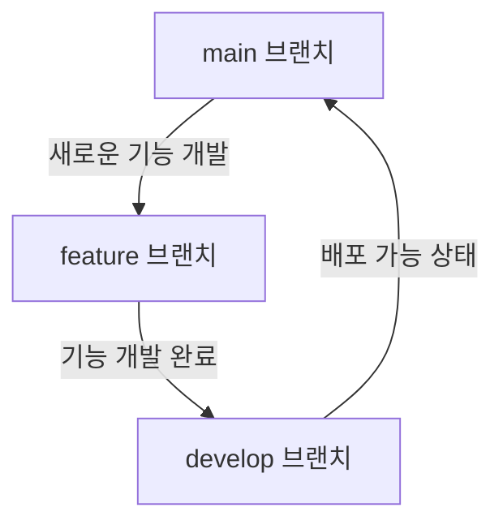

> Git flow에서 변형된 전략을 사용합니다. 반드시 아래 브랜치 특징을 참고하시길 바랍니다.

| 브랜치  | 설명                                     |
| ------- | ---------------------------------------- |
| main    | 배포 가능한 상태일 때 사용하는 브랜치    |
| develop | 개발 중인 전체 버전이 통합되는 브랜치    |
| feature | 단일 기능을 개발 중일 때 사용하는 브랜치 |

feature 브랜치는 기능 개발마다 새로 만들 수 있으며, 더 이상 필요 없는 브랜치라면 삭제가 가능합니다.  
로그인 기능을 구현할 경우 예시 : `feature/login`

**흐름도**

